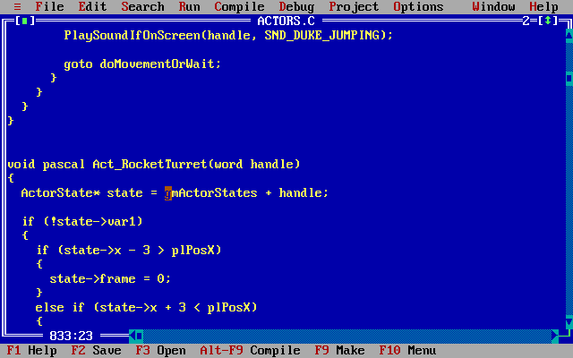

# Reconstucted source code for Duke Nukem II

This is a reconstruction of the source code of the game [Duke Nukem II](https://en.wikipedia.org/wiki/Duke_Nukem_II) (Apogee Software, 1993),
based on disassembly of the original executable.
It compiles with era-appropriate toolchains and produces a binary that's 100 % identical to the original one (see [Versions of the game](#game-versions)).

This project is meant for documentation and preservation,
and as a way to create modified versions targeting DOS (source mods).
If you're looking for a way to play the game on modern systems ("source port"),
check out [RigelEngine](https://github.com/lethal-guitar/RigelEngine).

## Background

In order to create RigelEngine, I spent countless hours dissecting the original game's assembly code in Ida Pro.
But RigelEngine's code is very different from what the original might have looked like,
and many of the low-level systems aren't represented at all since they have been replaced with
modern APIs in RigelEngine.

I think it's worthwhile to also preserve the original code as closely as possible,
since - to me at least - it's really interesting, educational, and fascinating.
With my reverse-engineering work, I had already done the hardest part of recreating the code,
it just wasn't in a shape that would be easily accessible/readable to other people:
The results were captured in handwritten notes, cryptic pseudocode, comments inside my Ida Pro project, and knowledge in my head.

So this is where this project comes in: Thoroughly commented C & Assembly code,
which can actually be compiled into a functional DOS executable using an era-appropriate toolchain.

## Acknowledgements

This project owes a lot to [Scott Smitelli](https://github.com/smitelli)'s excellent [Cosmore](https://github.com/smitelli/cosmore) project.
Duke Nukem II is an evolution of the Cosmo game engine, sharing many file formats and pieces of code.
Because of this, Cosmore helped me get a headstart on my own recreation project and made certain things significantly easier to figure out.

## How close to the original code is this?

TL;DR: The semantics and to some extent also syntax are identical,
but the code organization, formatting, and naming of identifiers are completely made up by me.

We know that the semantics of the code are 100% accurate, since the executable built from the source code is byte-for-byte identical to the original binary after LZEXE compression.
But how about other aspects of the source?
Not everything survives the compilation process,
so a decompilation can only approximate the original code to some extent.
A lot more can be determined from the assembly code than one might expect at first, though.
The game was built using a more simplistic compiler compared to what we have nowadays,
and not all optimizations were enabled.
Thus, the translation from C code to assembly is very direct,
allowing a pretty accurate reconstruction of the constructs used.
But of course, there are still limits.
In cetain cases, multiple different variations on the same construct
produce identical assembly, for example.

Overall, the following aspects are preserved in the compiled machine code:

* Control structures like loops, conditions, and switch statements
* Order of the branches in `if`/`else` statements, ternaries etc.
* Order of cases in switch statements
* Order of local variable declarations in functions
* Size of variables (8-bit, 16-bit, 32-bit)
* To some extent, signedness of variables
* Order in which functions are defined
* Order in which initialized global variables are declared
* Division of the code into translation units
* Compiler flags, to some extent

The following aspects aren't preserved, and can only be guessed at:

* Comments
* File names
* Formatting, use of optional parantheses etc.
* Identifiers like variable, type, and function names
* Type aliases
* Whether variables are global or function-local `static`
* Usage of `enum`s vs. individual constants (`#define`s)
* Anything involving the preprocessor: macros, conditionally compiled code, header files, etc.
* Whether code was written by hand or generated by a tool
* Project setup (did it use Makefiles or an IDE project, etc.)
* Exact location of global variables (i.e., in which translation unit they are declared)

## Structure of the code

The project is structured very similarly to Cosmo (see [Cosmore](https://github.com/smitelli/cosmore)).
The bulk of the code is arranged into only two very big translation units,
called `UNIT1.C` and `UNIT2.C` here (in Cosmore, the files are called `game1.c` and `game2.c`).
Scott Smitelli's theory is that this was done because the compiler generates slightly more efficient
near call instructions for functions in the same translation unit,
whereas calling into a separate unit incurs the overhead of a far call.

Also like in Cosmo, a set of low-level assembly routines is included into the C runtime startup code section,
by manually assembling and linking a modified version of the startup code (`C0.ASM`) which has these additional routines
included.

Unlike Cosmo, Duke 2 has two additional translation units with sound playback code,
at least one of which was almost certainly provided as a compiled library, not as source code.
Perhaps both of them were libraries, but it's not possible to tell definitely from the machine code for the other one.

We don't know how exactly the original code was organized at the source level,
it might have actually been two very big files, or it might have been split up
into multiple files using the [Unity build technique](https://en.wikipedia.org/wiki/Unity_build).

Since it's impossible to know the original organization,
I decided to focus on readability and split the code into multiple files via preprocessor includes.
I tried to group related functions together as best as possible,
but this wasn't always easy - the original order of functions
is often a bit random, with a few completely unrelated functions
sometimes appearing in the middle of a larger block of functions that
clearly belong together.

To keep the original order intact while still achieving some level of organization,
I therefore split up some pieces of code into multiple numbered files
like `ui1.c`, `ui2.c` etc., so that they can be included in the right places
with other unrelated functions appearing in-between.

## Useful context & background knowledge

To fully understand the code, it's useful to have some understanding of DOS programming,
especially the memory model and the extensions to the C language necessary to support it:

* [A look back at memory models in 16-bit MS-DOS](https://devblogs.microsoft.com/oldnewthing/20200728-00/?p=104012)
* [x86 memory segmentation](https://en.wikipedia.org/wiki/X86_memory_segmentation)
* [DOS memory management](https://en.wikipedia.org/wiki/DOS_memory_management)
* [The IBM PC](https://cosmodoc.org/topics/ibm-pc/)

Knowledge of x86 Assembly is also helpful, since there is a bit of inline Assembly
sprinkled throughout the code, and some of the low-level graphics routines are
completely written in Assembly. This isn't a necessity though, the vast majority of the code is C
and I've also tried my best to document the Assembly code thoroughly.

On top of that, the game also directly interfaces with various hardware components,
often using [Port I/O](https://wiki.osdev.org/Port_IO). This is sometimes done using
inline Assembly, but mostly using helper functions.

This was very common in DOS games. DOS itself only offered very limited access to the hardware (primarily filesystem and text mode output).
Another option was the BIOS, which provided some additional functionality. But often,
the only way to get graphics and sound at high performance was to talk to the hardware directly.
As a consequence, the code features a fair bit of hardware interaction, which would normally be
implemented in drivers and abstracted behind OS APIs on a modern system.
Most prominent is the use of the VGA/EGA interface to display images on screen,
followed by the SoundBlaster and AdLib interfaces for sound output.
Other hardware components used are generally standard features of any IBM PC (or compatible),
like the PC Speaker, keyboard controller, hardware timer, and Joystick port (gameport).

Some relevant resources:

* [Michael Abrash's Graphics Programming Black Book](https://www.jagregory.com/abrash-black-book/#chapter-23-bones-and-sinew).
* [Sound Blaster Series
Hardware Programming Guide](https://pdos.csail.mit.edu/6.828/2014/readings/hardware/SoundBlaster.pdf)
* [Programming the AdLib/Sound Blaster
FM Music Chips](http://www.shipbrook.net/jeff/sb.html)
* [IBM Game Control Adapter](http://minuszerodegrees.net/oa/OA%20-%20IBM%20Game%20Control%20Adapter.pdf)
* [IBM 5155/5160 - Technical Reference](http://minuszerodegrees.net/manuals/IBM_5155_5160_Technical_Reference_6280089_MAR86.pdf)

Fabian Sanglard's [Game Engine Black Book: Wolfenstein 3D](https://fabiensanglard.net/gebbwolf3d/index.html)
also covers many of these topics in a very easy to understand manner.

### Naming conventions

The code makes heavy use of global variables.
To help distinguish these from local variables,
and generally improve readability,
most of them are "namespaced" using short prefixes,
like `ui`, `hud`, `sys` (for "system") etc.

Some of the perhaps less obvious prefixes are `gm` for "game state", and `pl` for "player state".

Functions are generally not namespaced in this way, with some exceptions:

* `MM` is the memory manager
* `SB` is the SoundBlaster digital audio library
* `Map` is for code that interacts with the world map data during gameplay

### Comments

Some comments are prefixed with a tag: `[NOTE]`, `[BUG]`, `[HACK]`, `[PERF]` for 'performance', or `[UNSAFE]`.
Comments without a tag are explaining the code itself: What it does, how, and why, giving necessary context information etc.
Comments with a tag are sharing thoughts and observations I have about the code. Basically, a commentary (no pun intended) track.

## Building

There are two ways of building the project:

* Batch file build: creates a binary that's identical to the original one, but multiple specific compilers are needed, and the build isn't incremental
* Makefile build: you get an incremental build and any compatible compiler can be used, but the resulting binary will not match the original one as closely

These two approaches are described in more detail below.
If you're planning to modify and experiment with the code, I'd recommend the 2nd approach (Makefile build) since it's easier to set up and more flexible.

For both types of build, either a real DOS environment or an emulator like DosBox is needed in order to run the compiler(s).

The resulting executable is called `NUKEM2RE.EXE`.
To run it, you'll need the game data for Duke Nukem II and place it into the same directory as the executable.
Refer to [RigelEngine's README](https://github.com/lethal-guitar/RigelEngine/blob/master/README.md#acquiring-the-game-data) for more information on how to obtain a copy of the game.

### Batch file build for accurate recreation

The object files making up the different code segments in the original executable have been built using _three_ different compilers in total:
Borland C++ 3.0 was used to link the final binary, providing the standard library and startup code.
Jason Blochowiak's digital sound library was built with Borland C++ 3.1,
and the rest of the game code was built using Turbo C++ 3.0.

Therefore, in order to recreate a binary matching the original one as closely as possible, we need at least
Borland C++ 3.0 and Turbo C++ 3.0. I've added a pre-built `OBJ` file to the repo for the sound library,
so Borland C++ 3.1 isn't strictly needed. But it will be used if it's present.

First, install Borland C++ 3.0 into `C:\BORLANDC` and Turbo C++ 3.0 into `C:\TC`.
Borland C++ 3.1 is expected at `C:\BCC_31`, but as mentioned before, it's optional.
These locations are hardcoded into the batch file, but can be changed easily
by adjusting the variables at the top of the file.

Once everything is installed, `cd` into the `SRC` directory of the cloned repository and run `build.bat` for the registered version executable,
or `build.bat -s` for the shareware version.

The batch file also runs the LZEXE compressor on the created file after a successful build.

### Makefile build

For the Makefile build, you can use either Borland C++ 3.0 or 3.1.
Other compatible compilers (including Turbo C++ 3.0) may also work, but I haven't tested that.
And it might be necessary to replace `C0.ASM` with an equivalent file from the chosen compiler.

You can install the compiler to any location of your choice, but the default assumed
by the Makefile is `C:\BORLANDC`. To override it, pass `-DBCROOT=<location of your compiler>` to `make`.

Make sure to add the compiler's `BIN` directory to the `PATH`.

To build, simply invoke `make` in the `SRC` directory for the registered version executable,
or `make -DSHAREWARE` for the shareware version.

:warning: Borland's `make` doesn't rebuild when changing parameters. This means
you need to manually `make clean` and then rebuild when switching between shareware and registered version.

<h2><a id="game-versions">Versions of the game</a></h2>

As far as I'm aware, only a single version of the original game was ever released. However, the registered version's binary exists in two different variations:
One was compressed with LZEXE 0.91, the other one with PKLITE 1.15 (professional edition). The two variants are otherwise identical when decompressed (the relocation table is encoded differently, but also identical if normalized).
I used the LZEXE-compressed variant for this project.

For reference, here's a list of all the Duke Nukem II binaries I have,
along with their SHA-256 hashes.
The first two of them can be reproduced exactly using the source code in this repository.
The 3rd one should also be reproducible by using PKLITE instead of LZEXE, but I haven't tried that yet.

Type | Compression | Size | SHA256 | Origin
--- | --- | --- | --- | ---
Shareware | LZEXE | 58,852 b | `e31bfb7f1cf0cb9df0bd89bdeb3e9b3efd6541fe847f32366a403ed739596f1c` | old Apogee website, archive.org, etc.
Registered | LZEXE | 59,552 b | `f7c4a7a97ba2e71be75dae014ac623266e41b47debd861da6a2b75afdb107b63` | German PC Player magazine CD, August 2000 issue
Registered | PKLITE | 57,876 b | `09e57955ae7592df3ae587b6df7a61e37b8efaa6e5e7734fcdf50ff37624d53e` | US Big Box release by Formgen (3¼" disks)
